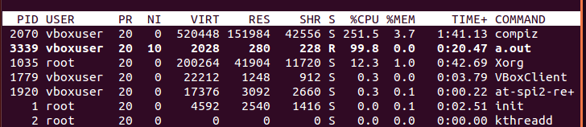

# Change Process' Priority when Context Switch on Linux Kernel 3.9.9

## 說明

此專案為 NCU Linux 2023 Fall 課程的 Project2，需實作一個 System call 使 process 能用其設置每次 context switch 時調整自己之 priority。

[Project Description](/ProjectDescription.pdf)

## 環境版本

+ Host OS: Windows 10 Enterprise Edition 22H2 19045.3693
+ VM: [Oracle VirtualBox 7.0.12 r159484](https://download.virtualbox.org/virtualbox/7.0.12/)
+ OS: [Ubuntu 14.04.6 LTS (Trusty Tahr) 32-bit PC (i386) desktop image](https://releases.ubuntu.com/trusty/)
+ Kernel: [linux-3.9.9](https://mirrors.edge.kernel.org/pub/linux/kernel/v3.x/linux-3.9.9.tar.gz)

## 環境準備

+ 於 VirtualBox 中新增虛擬機後需要先將帳戶新增 super user 的權限，使我們能夠使用 sudo，可使用以下方法新增 ([Ref. 1](https://superuser.com/a/1755286))

  

## 新增 System Call

請參考[此說明](https://github.com/larrylai19/get-physical-address-on-linux-kernel-3.9.9/blob/main/README-ZH-TW.md#%E6%96%B0%E5%A2%9E-system-call)。
    
## kernel 編譯

請參考[此說明](https://github.com/larrylai19/get-physical-address-on-linux-kernel-3.9.9/blob/main/README-ZH-TW.md#kernel-%E7%B7%A8%E8%AD%AF)。

## 實作

1. 於 Process Descriptor 中新增 `int my_fixed_priority` 欄位
    
    + 新增於 linux-3.9.9/include/sched.h 中 struct task_struct 中最後面
    + **僅可新增於最後面，若新增於中間可能會導致透過 base address + offset 取得某欄位的程式碼發生錯誤**
    
    

2. 於 copy process 中初始化 `my_fixed_priority` 的值
    
    + 新增於 linux-3.9.9/kernel/fork.c 中的 `static struct task_struct *copy_process`
    
    
    
3. 於 context_switch 中調整 `static_prio` 之值，使每次 context switch 到該 process 時都能觸發調整

    + 新增於 linux-3.9.9/kernel/sched/core.c 中的 `static inline void context_switch`
    
    
    
## 檢驗

於程式執行時使用 `top` 指令觀察 process 的優先度，主要看 PR, NI 兩欄，相加越小表優先度越高，下面三張圖為程式執行時之截圖。

## 調整 static_prio 與執行時間趨勢圖

**上圖可看出對於此專案調整 `static_prio` 對於執行時間並未有顯著的影響。**